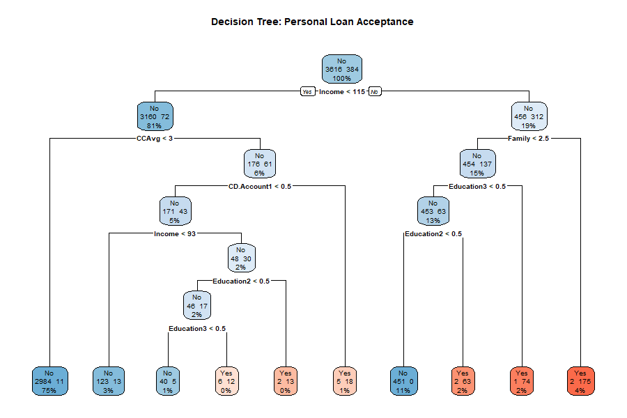
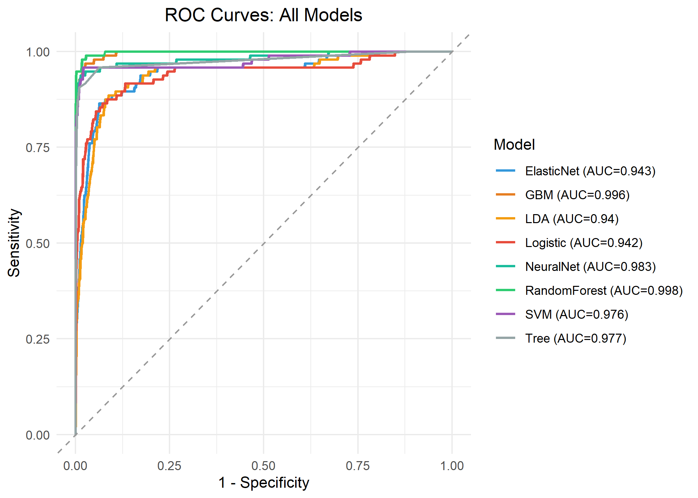
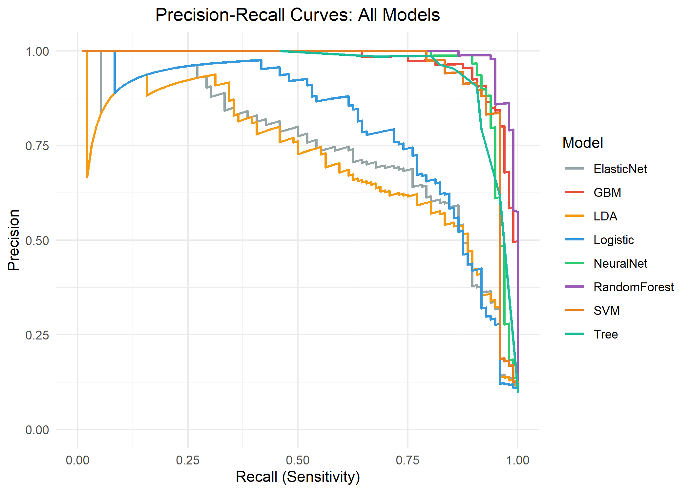
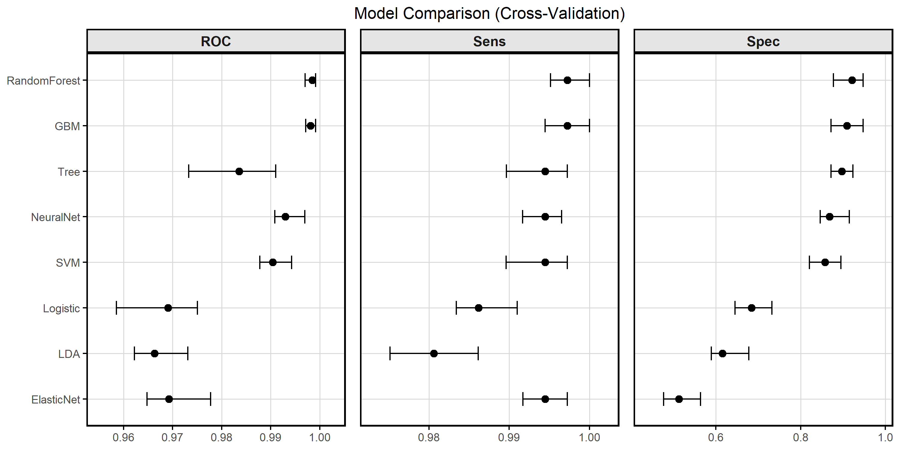
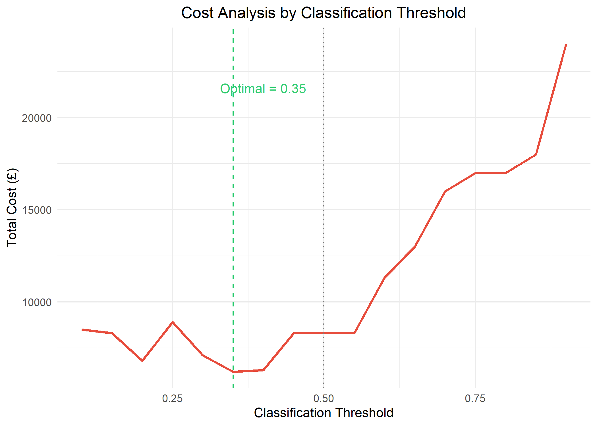
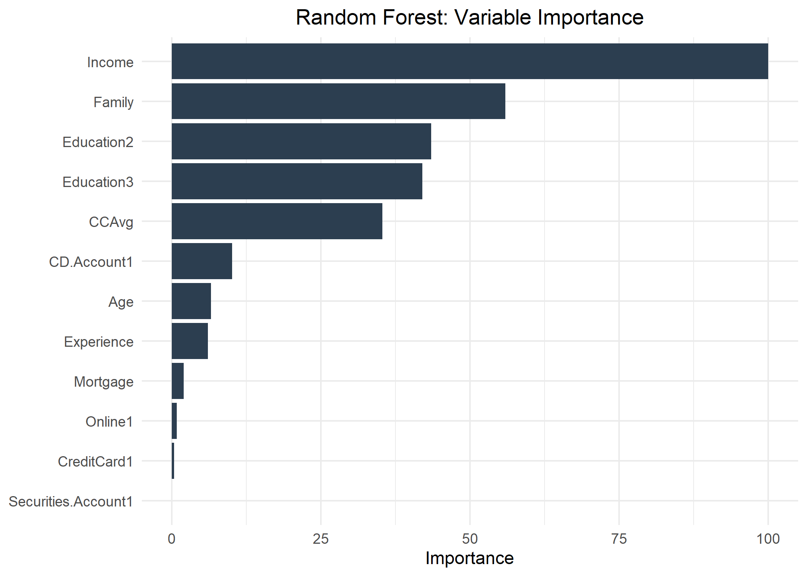
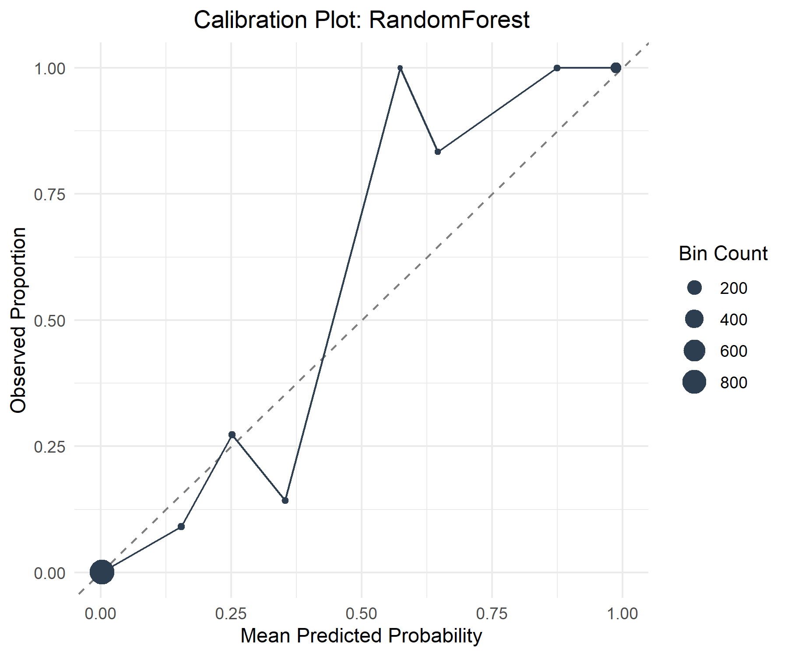

<p align="center">
  
</p>

<h1 align="center">Personal Loan Acceptance Prediction</h1>

<p align="center">
  <em>MISCADA ASML Classification Summative - Durham University</em>
</p>

<p align="center">
  
  
  
  
  
</p>

---

## Overview

Binary classification of personal loan acceptance using the Thera Bank dataset (5,000 customers, 9.6% positive rate). Eight models are trained, compared, and evaluated with a full cost-benefit threshold analysis. The goal is to predict which customers can be upsold to a personal banking loan, allowing future campaigns to be targeted more effectively.

## Dataset

The dataset contains 5,000 customer records from a Thera Bank marketing campaign. The target variable is `Personal.Loan` (1 = accepted, 0 = declined).

| Variable | Description | Type |
|----------|-------------|------|
| `Personal.Loan` | Customer accepted the loan offer | Binary (target) |
| `Income` | Annual income ($000) | Continuous |
| `CCAvg` | Average monthly credit card spend ($000) | Continuous |
| `Mortgage` | Home mortgage value ($000) | Continuous |
| `Age` | Customer age | Continuous |
| `Experience` | Professional experience (years) | Continuous |
| `Family` | Family size (1-4) | Discrete |
| `Education` | 1 = Undergrad, 2 = Graduate, 3 = Professional | Categorical |
| `CDAccount` | Certificate of deposit account with this bank | Binary |
| `Securities` | Securities account with this bank | Binary |
| `Online` | Uses internet banking | Binary |
| `CreditCard` | Uses a credit card from this bank | Binary |
| `ZipCode` | Home zip code *(removed - no predictive value)* | — |

## Results at a Glance

| | Random Forest | GBM | Neural Net | SVM | Decision Tree | Logistic | LDA | Elastic Net |
|---|:---:|:---:|:---:|:---:|:---:|:---:|:---:|:---:|
| **AUC** | **0.998** | 0.996 | 0.983 | 0.976 | 0.977 | 0.942 | 0.940 | 0.943 |
| **Sensitivity** | **0.917** | 0.896 | 0.906 | 0.854 | 0.906 | 0.635 | 0.500 | 0.417 |
| **F1** | **0.951** | 0.910 | 0.936 | 0.896 | 0.906 | 0.722 | 0.600 | 0.552 |

> **Random Forest** wins with AUC = 0.998, and threshold tuning to 0.35 reduces misclassification cost by 25%.

## Repository Structure

```
ASML/
├── 📄 ASML_Classification_Report.pdf  # Full compiled report
├── 📊 report.R                        # Master script - runs the full pipeline
│
├── 📁 R/
│   ├── data_exploration.R             # EDA, cleaning, visualisations
│   ├── models.R                       # 8 model definitions + CV training
│   └── evaluation.R                   # Test evaluation, plots, cost analysis
│
├── 📁 data/
│   └── bank_personal_loan.csv         # Thera Bank dataset (5,000 rows)
│
├── 📁 plots/                          # All generated figures (13 plots)
│
├── 📁 ASML Report/
│   ├── main.tex                       # LaTeX master document (IEEEtran)
│   ├── ExecutiveSummary.tex           # Part 1: non-technical summary
│   └── TechnicalSummary.tex           # Part 2: full technical write-up
│
├── 🔧 build.py                       # Local PDF compilation script
└── 📁 .github/workflows/
    └── build-report.yml               # CI: auto-compile PDF on push
```

## Quick Start

### Run the Analysis

```r
# From the project root in R/RStudio
source("report.R")
```

This will:
1. Install any missing packages automatically
2. Load and clean the dataset
3. Train all 8 models with 10-fold CV (x3 repeats)
4. Generate all 13 plots in `plots/`
5. Print test set metrics and cost analysis
6. Save `workspace.RData` for fast iteration

### Build the Report PDF

```bash
# Requires a LaTeX distribution (MiKTeX, TeX Live, or MacTeX)
python build.py --open
```

## Models

| # | Model | Method | Key Hyperparameters |
|---|-------|--------|-------------------|
| 1 | Decision Tree | `rpart` | `cp` ∈ [0.001, 0.05] |
| 2 | Logistic Regression | `glm` | - |
| 3 | LDA | `lda` | - |
| 4 | Elastic Net | `glmnet` | α ∈ {0, 0.5, 1}, λ ∈ [10⁻⁴, 10⁻¹] |
| 5 | Random Forest | `rf` | `mtry` ∈ {2,3,4,5,6,8}, 500 trees |
| 6 | SVM (RBF) | `svmRadial` | σ ∈ {0.01, 0.05, 0.1}, C ∈ {0.1, 1, 10} |
| 7 | GBM | `gbm` | trees ∈ {100,300,500}, depth ∈ {1,3,5} |
| 8 | Neural Network | `nnet` | size ∈ {5,10,20}, decay ∈ {0.001, 0.01, 0.1} |

## Key Plots

<details>
<summary><b>ROC Curves</b></summary>
<br>

</details>

<details>
<summary><b>Precision-Recall Curves</b></summary>
<br>

</details>

<details>
<summary><b>Cross-Validation Comparison</b></summary>
<br>

</details>

<details>
<summary><b>Cost Analysis</b></summary>
<br>

</details>

<details>
<summary><b>Feature Importance</b></summary>
<br>

</details>

<details>
<summary><b>Calibration</b></summary>
<br>

</details>

## Dependencies

All R packages are installed automatically when running `report.R`. For reference:

```
tidyverse, caret, pROC, glmnet, randomForest, e1071, gbm, MASS, rpart.plot, nnet, ggplot2
```

## Reproducibility

- Fixed seed: `set.seed(42)`
- Shared CV folds across all models via `createMultiFolds`
- Tested on R 4.4.2+

---

<p align="center">
  <sub>Durham University - MISCADA Applied Statistical Modelling and Machine Learning - 2025/26</sub>
</p>
